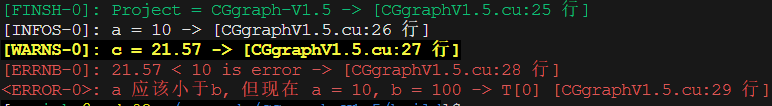

<span style="font-size: larger; cursor: pointer;">&#9758;</span> [Switch to English](README_EN.md)
## CGgraph-V1.5
让CPU和GPU协同处理图数据，论文 `CGgraph: An Ultra-fast Graph Processing System on Modern Commodity CPU-GPU Co-processor` 源码。目前版本为V1.5，我们将持续进行更新和优化。

---
## CGgraph的依赖
- 主机端
	- C++  (>11.4.0)
	- OpenMP
	- TBB
- 设备端
    - CUDA (>12.3)
	- Thrust
	- CUB
- 命令行
	- [gflags](https://github.com/gflags/gflags)
---
## CGgraph的数据类型
- **位置**：src/Basic/Type/data_type.hpp
- **解释**：
	- `vertex_id_type`： 表示图数据中顶点的数据类型
	- `edge_data_type`： 表示图数据中边的权重的数据类型
	- `vertex_data_type`： 表示图数据中顶点值的数据类型，例如，BFS通常为整型，而PageRank通常为浮点型
	- `count_type`： 表示图数据中顶点个数的数据类型，如果图数据的总顶点数超过了uint32_t的最大可表示范围，则需要将count_type设置为uint64_t
	- `countl_type`： 表示图数据中边的数量的数据类型，如果图数据的总边数超过了uint32_t的最大可表示范围，则需要将countl_type设置为uint64_t
	- `degree_type`： 表示图数据中度的数据类型
- **注意**：请确保准确定义各个数据类型。例如，当总边数没有超过uint32_t的最大可表示范围时，不应将countl_type定义为uint64_t，程序中会有相应的提醒
---
## CGgraph的图数据输入
- **位置**：src/Basic/Graph/graphFileList.hpp
- **说明**：
	1. CGgraph的输入是二进制的CSR文件，每个图的CSR文件需要包括3个文件：
		- csrOffsetFile：图中每个顶点在边数组中的起始位置，数据类型为 `countl_type`，长度为总顶点数加1
		- csrDestFile：图中每条边的目标节点信息，数据类型为 `vertex_id_type`，长度为总边数
		- csrWeightFile：图中每条边的权重信息，数据类型为 `edge_data_type`，长度为总边数
     2. graphFileList 是一个图数据文件的集合，可以在编译前将要运行的图数据文件加入到该文件中。例如，添加 ***graphName*** 为 *friendster* 和 *uk-union* 的图数据：
     ```cpp
	 if (graphName == "friendster") 
	 {
		graphFile.vertices = 124836180; // 总顶点数
	    graphFile.edges = 1806067135; // 总边数
		graphFile.csrOffsetFile = "/data/bin/friendster/native_csrOffset_u32.bin"; //文件路径
        graphFile.csrDestFile = "/data/bin/friendster/native_csrDest_u32.bin";     //文件路径
        graphFile.csrWeightFile = "/data/bin/friendster/native_csrWeight_u32.bin"; //文件路径
	 } 
	 else if (graphName == "uk-union")
	 {
		graphFile.vertices = 133633040; // 总顶点数
        graphFile.edges = 5475109924;// 总边数
		graphFile.csrOffsetFile = "/data/bin/friendster/native_csrOffset_u32.bin"; //文件路径
        graphFile.csrDestFile = "/data/bin/friendster/native_csrDest_u32.bin";     //文件路径
        graphFile.csrWeightFile = "/data/bin/friendster/native_csrWeight_u32.bin"; //文件路径
	 }
	 ```

---
## CGgraph的运行
- CGgraph在运行时, 会根据定义的***graphName***来识别不同的图数据，同时***graphName***在程序中会被多次调用；
- 程序编译完成后，会生成名为CGgraphV1.5的可运行文件，可以通过在终端中执行以下命令`$ CGgraphV1.5 --help`来获取如下信息：
 ```
    -algorithm (The Algorithm To Be Run: [0]:BFS, [1]:SSSP) type: int32
      default: 0
    -gpuMemory (The GPU Memory Type: [0]:GPU_MEM, [1]:UVM, [2]:ZERO_COPY)
      type: int32 default: 0
    -graphName (The Graph Name) type: string default: "friendster"
    -root (The Root For BFS/SSSP Or MaxIte For PageRank) type: int64
      default: 0
    -runs (The Number Of Times That The Algorithm Needs To Run) type: int32
      default: 5
    -useDeviceId (The GPU ID To Be Used) type: int32 default: 0
```
- **说明**:
   1. gpuMemory：用于定义要使用的GPU内存类型。由于CGgraph是一个CPU和GPU协同执行的系统，考虑到GPU内存的有限性，我们将GPU内存的使用类型主要分为以下几种情况：
	  - 当GPU内存足以容纳全部图数据时，启用 `GPU_MEM` 可以获得更好的性能；
	  - 当GPU内存只能容纳部分图数据，并且可以容纳的部分达到图数据的某个比例R%时，启用 `GPU_MEM` 会有更好的性能；
	  - 当GPU内存只能容纳部分图数据，并且可以容纳的部分不足图数据的R%时，用户需要启用 `UVM` 或者 `ZERO_COPY`（程序会有相应提醒）。在实践中，启用 `ZERO_COPY` 在某些情况下会获得更好的性能；
	2.  CGgraph-V1.5 先优化了BFS和SSSP算法，剩余的WCC和PageRank算法的优化会很快更新；
	3. 首次运行CGgraph-V1.5时，先选择一个图数据集，确保该数据集的大小可以完全容纳在GPU内存中，以便程序能够充分了解CPU和GPU之间的性能差异；
-  **例子**:
	如果想要运行 ***graphName*** 为 *friendster* 的图数据文件的BFS算法，则执行:
`$ CGgraphV1.5 -graphName friendster -algorithm 0 -gpuMemory 0 -root 100 -runs 5  -useDeviceId 0`
	如果程序正常运行控制台会得到以下结果 (12Cores CPU + 2560Cores GPU):
	
	当然，大量控制台输出有时会略微损失一部分CGgraphV1.5的性能。
---

## 其它分享
以下内容是本人自己封装且感觉还不错的轻量级工具，欢迎尝试使用。如果有不合适的地方，欢迎给出建议。

### 控制台打印和日志输出
- **位置**：
  - src/Basic/Console/console_V3_3.hpp
  - src/Basic/Log/log.hpp
- **解释**：
	- `Msg_info` 白色的输出
	- `Msg_check` 绿色的输出
	- `Msg_finish` 绿色的输出
	- `Msg_warn` 黄色的输出
	- `Msg_error` 红色的输出
	- `Msg_node` 在分布式环境下，仅master打印
	- `Log_info` 输出到指定的日志文件
	- `assert_msg` 带打印的断言
	- `assert_msg_clear`  带打印的断言，出错会跳转到指定的goto
- **带smart的解释**：更高版本的C++会有替代方案
  	- `Msg_info_smart` 白色的输出(无需手动指定要打印的数据类型)
	- `Msg_check` 绿色的输出 (无需手动指定要打印的数据类型)
	- `Msg_finish` 绿色的输出(无需手动指定要打印的数据类型)
	- `Msg_warn` 黄色的输出(无需手动指定要打印的数据类型)
	- `Msg_error` 红色的输出(无需手动指定要打印的数据类型)
	- `assert_msg` 带打印的断言 (无需手动指定要打印的数据类型)
	- `assert_msg_clear`  带打印的断言，出错会跳转到指定的goto (无需手动指定要打印的数据类型)
- **说明**：
  - `ISCONSOLE` 设置为0则以上定义不在控制台输出
  - `ISLOG` 设置为0则以上定义不在日志输出
  - 注: 日志打印会增加程序的执行时间，但方便调试程序，根据需求使用
- **例子**：
	- 使用：
	- 效果： 


  		